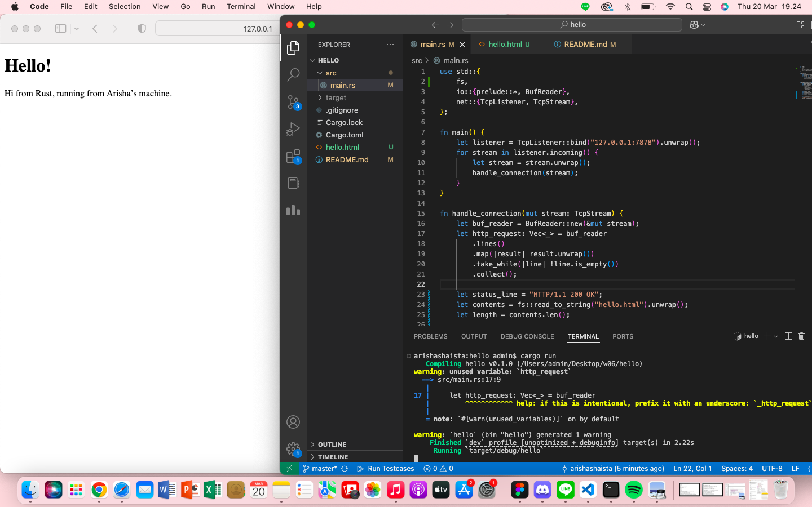

# AdvProg-Module 6

- [Single-Threaded Web Server](#1-single-threaded-web-server)
- [Returning HTML](#2-returning-html)

## 1. Single-Threaded Web Server
Dalam membangun single-threaded web server, terdapat dua protokol utama yang terlibat, yaitu **Hypertext Transfer Protocol (HTTP)** dan **Transmission Control Protocol (TCP)**.
- **TCP (Transmission Control Protocol)** adalah protokol tingkat rendah yang menentukan cara data dikirim antara klien dan server, tetapi tidak menentukan isi dari data tersebut.
- **HTTP (Hypertext Transfer Protocol)** digunakan untuk menentukan format *request* dan *response* yang dikirim melalui TCP.

Secara prinsip, komunikasi antara klien dan server dalam web server Rust ini mengikuti model *request-response*, yaitu:
- Klien (browser) mengirimkan *request* ke server melalui HTTP.
- Server menerima *request*, memprosesnya, dan mengirimkan *response* kembali ke klien.

Pada awalnya, program hanya mampu menerima koneksi dari browser menggunakan `TcpListener` yang berjalan di alamat `127.0.0.1:7878`. Program akan mencetak "Connection established!" setiap kali ada koneksi yang masuk.

Fungsi yang Digunakan dalam Koneksi:
- `bind()` → Menghubungkan TcpListener ke alamat dan port tertentu pada mesin lokal agar bisa mendengarkan koneksi.
- `unwrap()` → Mengekstrak hasil dari Result<T, E>. Jika terjadi error, program akan panic dan berhenti.
- `incoming()` → Mengembalikan iterator dari koneksi yang masuk, di mana setiap koneksi diwakili oleh TcpStream.

Setelah koneksi diterima, program harus memproses request dari browser. Untuk itu, dibuat fungsi `handle_connection()`, yang akan membaca HTTP request dan menampilkannya di terminal.

Fungsi yang Digunakan dalam handle_connection():
- `BufReader::new(&mut stream)` → Membaca data dari TcpStream dalam format teks, baris demi baris.
- `lines()` → Mengubah stream menjadi iterator yang menghasilkan setiap baris teks dari request HTTP.
- `take_while(|line| !line.is_empty())` → Menghentikan pembacaan saat menemukan baris kosong (\r\n), karena ini menandakan akhir dari request HTTP.
- `collect()` → Mengumpulkan hasil pembacaan ke dalam vektor (Vec<String>) untuk diproses lebih lanjut.

## 2. Returning HTML
Screenshot:
 

 Fungsi `handle_connection` memanfaatkan `fs::read_to_string` untuk memuat isi file `hello.html` ke dalam sebuah string. Dengan cara ini, server dapat mengirimkan halaman HTML sebagai bagian dari respons kepada pengguna.

Setelah itu, server menyusun respons HTTP dengan status line `"HTTP/1.1 200 OK"` serta menambahkan header `Content-Length` yang menunjukkan ukuran konten HTML yang akan dikirim. Konten HTML tersebut kemudian dimasukkan sebagai body dari respons.

Terakhir, respons HTTP dikirimkan kepada klien melalui koneksi TCP stream menggunakan metode `write_all`, sehingga browser dapat menerima dan menampilkan halaman yang diminta.