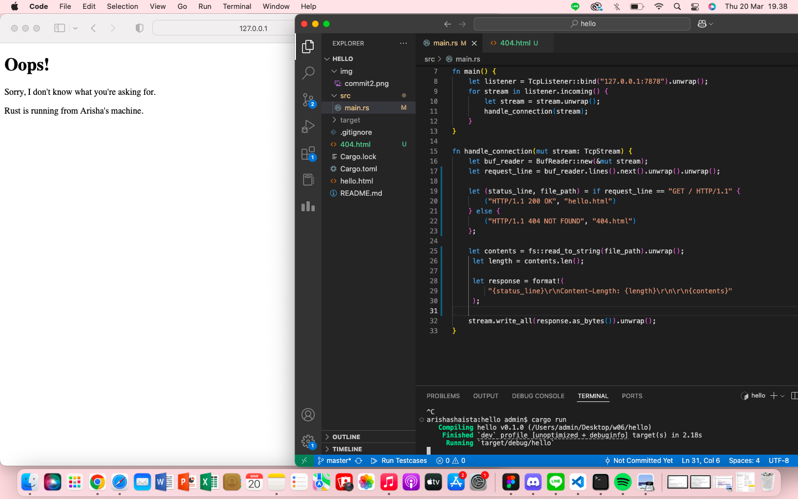

# AdvProg-Module 6

- [Commit 1 Reflection Notes](#commit-1-reflection-notes)
- [Commit 2 Reflection Notes](#commit-2-reflection-notes)
- [Commit 3 Reflection Notes](#commit-3-reflection-notes)
- [Commit 4 Reflection Notes](#commit-4-reflection-notes)
- [Commit 5 Reflection Notes](#commit-5-reflection-notes)
- [Commit Bonus Reflection Notes](#commit-bonus-reflection-notes)

## Commit 1 Reflection Notes
Dalam membangun single-threaded web server, terdapat dua protokol utama yang terlibat, yaitu **Hypertext Transfer Protocol (HTTP)** dan **Transmission Control Protocol (TCP)**.
- **TCP (Transmission Control Protocol)** adalah protokol tingkat rendah yang menentukan cara data dikirim antara klien dan server, tetapi tidak menentukan isi dari data tersebut.
- **HTTP (Hypertext Transfer Protocol)** digunakan untuk menentukan format *request* dan *response* yang dikirim melalui TCP.

Secara prinsip, komunikasi antara klien dan server dalam web server Rust ini mengikuti model *request-response*, yaitu:
- Klien (browser) mengirimkan *request* ke server melalui HTTP.
- Server menerima *request*, memprosesnya, dan mengirimkan *response* kembali ke klien.

Pada awalnya, program hanya mampu menerima koneksi dari browser menggunakan `TcpListener` yang berjalan di alamat `127.0.0.1:7878`. Program akan mencetak "Connection established!" setiap kali ada koneksi yang masuk.

Fungsi yang Digunakan dalam Koneksi:
- `bind()` → Menghubungkan TcpListener ke alamat dan port tertentu pada mesin lokal agar bisa mendengarkan koneksi.
- `unwrap()` → Mengekstrak hasil dari Result<T, E>. Jika terjadi error, program akan panic dan berhenti.
- `incoming()` → Mengembalikan iterator dari koneksi yang masuk, di mana setiap koneksi diwakili oleh TcpStream.

Setelah koneksi diterima, program harus memproses request dari browser. Untuk itu, dibuat fungsi `handle_connection()`, yang akan membaca HTTP request dan menampilkannya di terminal.

Fungsi yang Digunakan dalam handle_connection():
- `BufReader::new(&mut stream)` → Membaca data dari TcpStream dalam format teks, baris demi baris.
- `lines()` → Mengubah stream menjadi iterator yang menghasilkan setiap baris teks dari request HTTP.
- `take_while(|line| !line.is_empty())` → Menghentikan pembacaan saat menemukan baris kosong (\r\n), karena ini menandakan akhir dari request HTTP.
- `collect()` → Mengumpulkan hasil pembacaan ke dalam vektor (Vec<String>) untuk diproses lebih lanjut.

## Commit 2 Reflection Notes
Screenshot:
 

 Fungsi `handle_connection` memanfaatkan `fs::read_to_string` untuk memuat isi file `hello.html` ke dalam sebuah string. Dengan cara ini, server dapat mengirimkan halaman HTML sebagai bagian dari respons kepada pengguna.

Setelah itu, server menyusun respons HTTP dengan status line `"HTTP/1.1 200 OK"` serta menambahkan header `Content-Length` yang menunjukkan ukuran konten HTML yang akan dikirim. Konten HTML tersebut kemudian dimasukkan sebagai body dari respons.

Terakhir, respons HTTP dikirimkan kepada klien melalui koneksi TCP stream menggunakan metode `write_all`, sehingga browser dapat menerima dan menampilkan halaman yang diminta.

## Commit 3 Reflection Notes
Screenshot:
 

 Pada awalnya, web server selalu menampilkan `hello.html` tanpa memperhatikan jenis *request* yang dikirimkan oleh browser. Saat ini, ditambahkan logika untuk memeriksa apakah permintaan berasal dari / sebelum mengembalikan halaman HTML. Jika permintaan tidak sesuai, server akan mengembalikan respons dengan kode status 404 beserta halaman error (404.html). Cara menangani `404.html` serupa dengan `hello.html`, yaitu dengan membaca dan mengirimkan file sebagai respons.

 ```rust
 let request_line = buf_reader.lines().next().unwrap().unwrap();
```

Penjelasan:

- `.lines()` → Menghasilkan iterator yang membaca setiap baris dari BufReader.
- `.next()` → Mengambil baris pertama dari iterator tersebut.
- `unwrap() pertama` → Mengekstrak nilai dari Option, jika ada.
- `unwrap() kedua` → Mengekstrak nilai dari Result, jika operasi sebelumnya berhasil.

Untuk menjaga kode tetap bersih dan terstruktur sesuai prinsip DRY (Don't Repeat Yourself), dilakukan refactoring pada main.rs. Sebelumnya, variabel status_line dan contents dideklarasikan secara terpisah dalam setiap blok if-else, sehingga tidak dapat digunakan secara fleksibel di luar cakupannya. Untuk mengatasi hal ini, pendekatan yang lebih efisien digunakan dengan mendefinisikan kedua variabel secara bersamaan di satu tempat menggunakan let (status_line, contents) = ....

Dengan cara ini, dapat dihindari pengulangan kode dan memastikan bahwa respons HTTP dikonstruksi dengan lebih rapi dan efisien tanpa perlu mendeklarasikan variabel yang sama berkali-kali.

## Commit 4 Reflection Notes
Pada bagian ini, akan mensimulasikan respons lambat pada web server. Untuk mencapainya, menggunakan fungsi `thread::sleep`, yang memungkinkan kita menunda eksekusi program selama waktu tertentu. Selain itu, dapat dimanfaatkan match untuk memeriksa request line yang dikirimkan oleh klien.

Jika server menerima permintaan dengan `"GET /sleep HTTP/1.1"`, maka server akan tertunda selama 10 detik sebelum mengirimkan respons. Hal ini dirancang untuk mensimulasikan keterlambatan respons, yang dapat berdampak pada permintaan lain yang dikirim ke server.

Untuk menguji efeknya, dapat dibuka dua jendela browser secara bersamaan—satu menuju endpoint `/`dan satu lagi ke `/sleep`. Jika kita mencoba mengakses `/` setelah menjalankan `/sleep`, kita akan melihat bahwa halaman `/` tidak langsung dimuat, melainkan harus menunggu hingga proses sleep selama 10 detik selesai. Hal ini menunjukkan bagaimana server menangani request dalam single-threaded mode, di mana satu request yang berjalan lama dapat menghambat eksekusi request lainnya.

## Commit 5 Reflection Notes
Pada tahap ini, web server ditingkatkan dari single-threaded menjadi multi-threaded agar dapat menangani banyak permintaan secara bersamaan. Untuk mencapai hal ini, digunakan ThreadPool, yang berfungsi mengelola sejumlah thread agar dapat menangani berbagai tasks dengan lebih efisien. Awalnya, ThreadPool hanya menyimpan daftar Worker, di mana setiap Worker merupakan struktur yang terdiri dari JoinHandle<()> untuk menangani eksekusi pada tiap thread.

Agar server dapat bekerja dalam mode multi-threaded, ThreadPool diperbarui sehingga menyimpan vektor Worker. Setiap Worker memiliki ID unik serta sebuah thread yang diinisialisasi menggunakan closure kosong. Pada saat ThreadPool dibuat, sistem juga membentuk channel komunikasi, di mana sender (pengirim) disimpan dalam ThreadPool, sementara receiver (penerima) disalin ke setiap Worker.

Ketika ada task baru, fungsi execute akan mengirimkan closure tugas melalui sender channel, yang kemudian akan diproses oleh thread yang tersedia. Worker akan terus mengambil tugas baru dari receiver channel dalam loop, menggunakan mutex untuk menghindari konflik akses data (race condition).

Dengan pendekatan ini, ThreadPool dapat menangani banyak permintaan secara bersamaan tanpa menciptakan terlalu banyak thread yang berlebihan, sehingga dapat menghindari overhead dan menjaga efisiensi sistem. Selain itu, penggunaan channel sebagai mekanisme komunikasi antar-thread memastikan distribusi tugas yang aman tanpa menyebabkan kesalahan sinkronisasi (race condition). Dengan demikian, web server menjadi lebih efisien dan mampu menangani beban kerja yang lebih tinggi tanpa mengalami keterlambatan akibat model single-threaded sebelumnya.

## Commit Bonus Reflection Notes
Pada tahap ini,  diperkenalkan sebuah fungsi baru bernama build, yang berfungsi sebagai pengganti dari new. Proses refactoring ini mengacu pada pedoman dalam buku Rust pada bagian Refactoring to Improve Modularity and Error Handling.

Perbedaan utama antara build() dan new() terletak pada pendekatan dalam menangani error. Fungsi build() dirancang untuk memberikan penanganan error yang lebih baik dengan mengembalikan Result, sedangkan new() cenderung langsung memicu panic! saat terjadi kesalahan yang tidak terduga.

Salah satu peningkatan penting dalam build() adalah kemampuannya untuk memvalidasi ukuran ThreadPool yang diberikan. Jika nilai yang dimasukkan adalah 0 atau angka negatif, fungsi ini akan mengembalikan Err dengan pesan yang menjelaskan bahwa ukuran tersebut tidak valid atau tidak masuk akal. Dengan pendekatan ini, kita dapat menghindari kesalahan yang tidak diinginkan dan membuat kode lebih modular serta lebih aman dalam menangani berbagai skenario error.